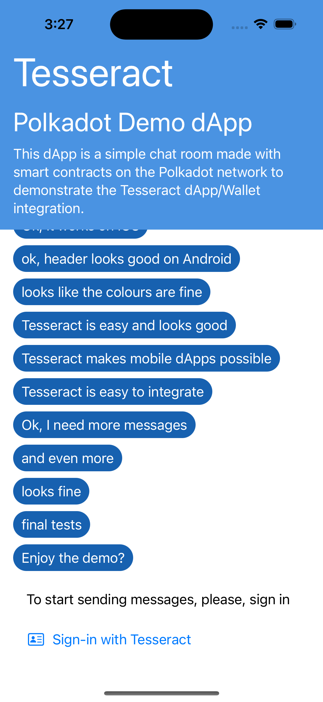

<p align="center">
	<a href="http://tesseract.one/">
		
	</a>
</p>

### **Polkadot Chat demo dApp** is a demonstration of how [Tesseract](https://github.com/tesseract-one/) provides wallet integration for dApps on mobile

<p align="center">
    
    
    
</p>

## Prerequisites

### Common prerequisites

Install Rust Environment (nightly) from [here](https://www.rust-lang.org/tools/install).

### Android prerequisites

1. Install Android toolchanins:

```bash
rustup target add aarch64-linux-android armv7-linux-androideabi i686-linux-android x86_64-linux-android
```

2. Install [Android Studio](https://developer.android.com/studio)
3. Install [Android NDK](https://developer.android.com/studio/projects/install-ndk#default-version) (no need for CMAKE)

### iOS prerequisites

1. Install iOS toolchanins:

```bash
rustup target add aarch64-apple-ios-sim aarch64-apple-ios x86_64-apple-ios
```

2. Install Xcode from the App Store

## Installation

### Installation on Android

1. Checkout [this repo](https://github.com/tesseract-one/polkachat.rs) and [Tesseract.android](https://github.com/tesseract-one/Tesseract.android) side by side.
2. Open polkachat.rs folder in Android Studio.
3. Check `local.properties.example` and copy the ones you need for your environment (i.e. your NDK version) into your `local.properties`.
4. Run it on a desired device (or emulator).

### Installation on iOS

1. Checkout [this repo](https://github.com/tesseract-one/polkachat.rs).
2. Open `ios/PolkaChat.xcodeproj` in Xcode.
3. Run the **Polka Chat**.

## License

Tesseract.rs can be used, distributed and modified under [the Apache 2.0 license](LICENSE).
